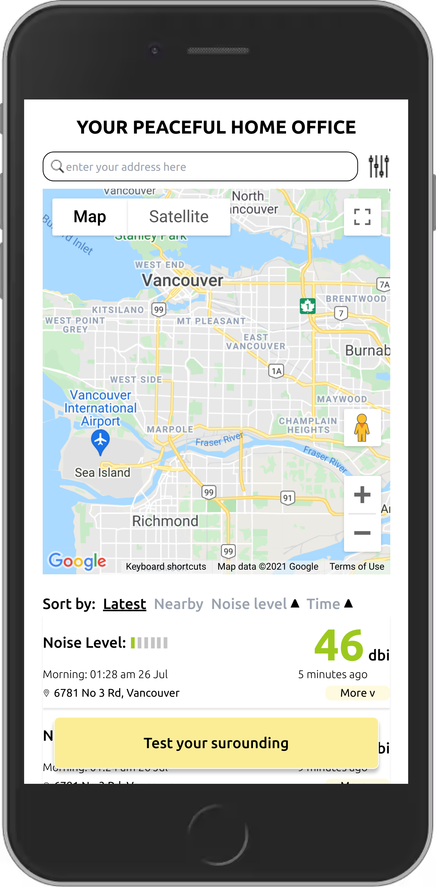
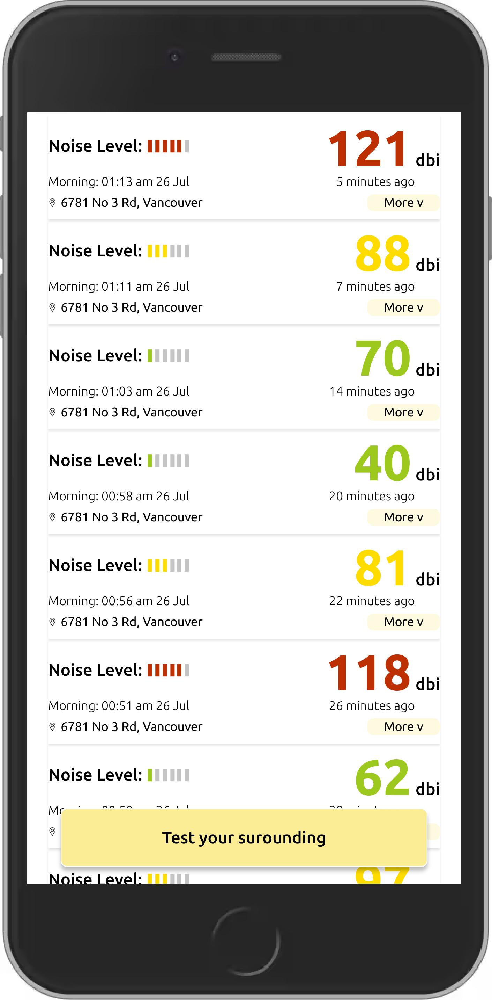
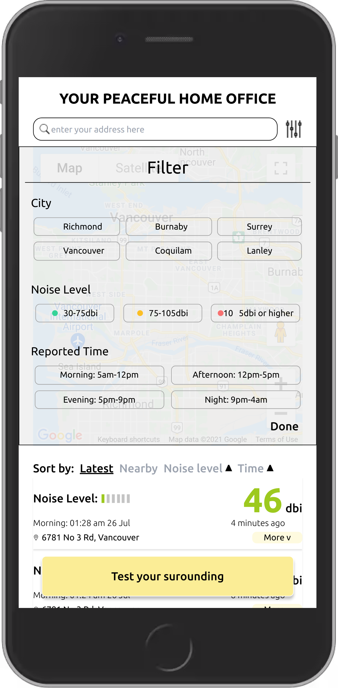
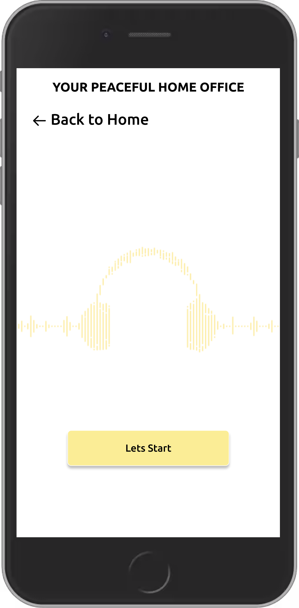
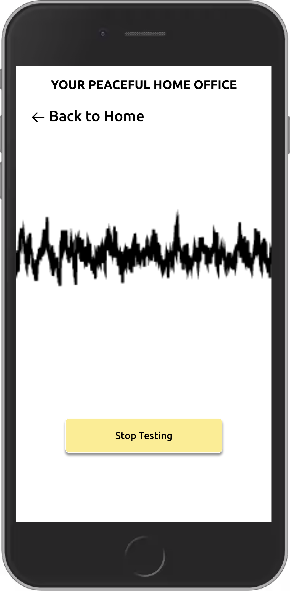

# About this project -- Your Peaceful home Office

This project was created for [the 24-hour 2021 Virtual Hack4Health event](https://event.hackhub.com/event/hack4health).

Our idea and application aim to help people looking to move to a new place or new office by showing them the decibel numbers around metro Vancouver, which can be found either by searching specific names or addresses or filtering out with Noise Level, City and Report time.

Also, our application allows users to test the noise level around them by using the devices' microphones and showing them the decibel numbers. After getting a number, the users will upload this number and share it with other users by filling in more information like location and current time. This post will be shown on the front page and seen by other users. Users who contribute posts will be rewarded. 

Feel free to explore more about our project!

# Design Prototype and Implementation

1. Mobile web application UX/UI Design: Link to the [Prototype](https://www.figma.com/file/8z3EFYRZ8GqpPWJskzuEdi/HomeOffice?node-id=0%3A1)

2. Implementation: We've completed half of our desired task list.

   - [x] Map render
   - [x] Map Autocomplete: need to be improved
   - [x] Sound classify by dbi value
   - [x] Sound Test: need to improve accuracy
   - [x] Sound Test result upload to backend
   - [x] Online deployment and host
   - [ ] Map Marker and search
   - [ ] Device Geo location obtain
   - [ ] Sound Filter by categories
   - [ ] ...

3. The implemented feature of the project is deployed on Oracle cloud: http://158.101.6.188/

	> :warning:  However, as we haven't applied the SSL certificate and domain name. There is issue to start a media(audio) test without the HTTPS support, see https://developer.mozilla.org/en-US/docs/Web/API/MediaDevices/getUserMedia.

# Screenshots

|                          Home Page                         |                 Uploaded Sound Test Records                         |                            Sound Search Filters                             |
| :--------------------------------------------------------: | :----------------------------------------------------------------: | :-------------------------------------------------------------------------: |
|  |  |  |

|                        Before a Sound Test                  |                                    Sound Test Curve                               |                                Sound Test Result                               |
| :---------------------------------------------------------: | :-------------------------------------------------------------------------------: | :----------------------------------------------------------------------------: |
|  |  |    |

# Project Team

- Developer -- Kevin Deng [Github](https://github.com/denven) 

- Developer -- Kenneth Zhang [Github](https://github.com/Kennethz374) | [Linkedin](https://www.linkedin.com/in/kenneth-zhang-9a785673/)

- Developer -- Zongxi Li [Github](https://github.com/zongxili) | [Linkedin](https://www.linkedin.com/in/zongxi-li/)

- Designer -- Dora Tao [Linkedin](https://www.linkedin.com/in/dora-tao/)

- Designer -- Swan Li [Linkedin](https://www.linkedin.com/in/swan-li-27368a172/)

